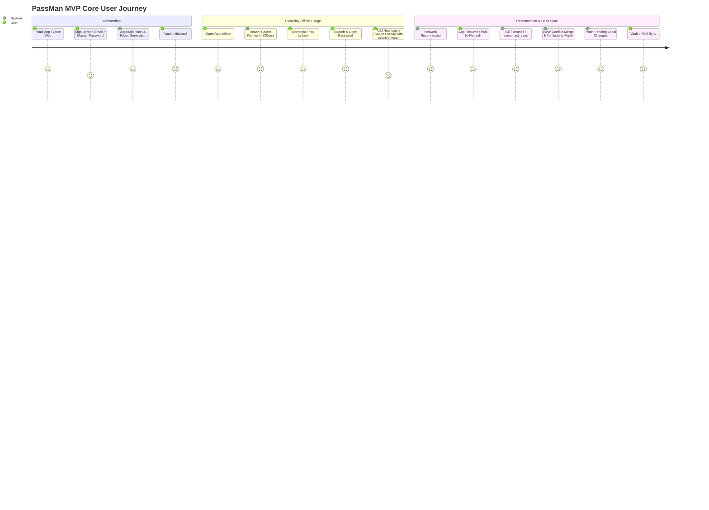

# Product Requirements Document (PRD)
## PassMan — Offline-First, Zero-Knowledge Cross-Platform Password Manager

**Version:** 1.0 (MVP)  
**Status:** Approved  
**Target Platforms:** Android & Web (Flutter)  
**Backend:** FastAPI (Python) & Supabase (PostgreSQL 15)  

---

## 1. Executive Summary & Vision

### 1.1 Product Vision
**PassMan** is a secure, lightweight, cross-platform password manager designed from the ground up on two non-negotiable principles: **Zero-Knowledge Privacy** and **Offline-First Usability**. PassMan enables users to securely store, retrieve, update, and manage sensitive credentials across Android and Web devices without trusting the backend server with plaintext secrets.

### 1.2 Core Value Proposition
- **Absolute Privacy (Zero-Knowledge):** All encryption and decryption operations occur strictly client-side using industry-standard **AES-256-GCM**. The backend server and database only ever process, store, and transmit opaque ciphertext, initialization vectors (IV), authentication tags, and timestamps.
- **True Offline-First Architecture:** The client interface renders immediately from local storage (`sqflite` on Android, `Hive` on Web) without waiting for network calls. Full CRUD operations can be performed offline and are automatically synchronized when connectivity resumes.
- **Deterministic Delta Synchronization:** High-efficiency delta sync (`GET /api/vault/entries?since=<timestamp>`) with **Last-Write-Wins (LWW)** conflict resolution and tombstoned soft deletes ensures seamless cross-device state convergence with zero data corruption.
- **Unified Security & Device Session Flow:** High-performance Argon2id master password hashing on the server, paired with biometric/PIN unlocking on mobile and secure key derivation in client memory.

---

## 2. Target Personas & Use Cases

### 2.1 Target Personas
1. **The Privacy-Conscious User (Alex, Security Enthusiast):**
   - *Needs:* Assurance that cloud storage breaches or compromised infrastructure cannot expose raw passwords.
   - *Behavior:* Inspects security models and expects true client-side zero-knowledge encryption.
2. **The Mobile-First On-The-Go User (Priya, Professional):**
   - *Needs:* Instant access to credentials in subways, flights, or areas with spotty network coverage.
   - *Behavior:* Needs quick biometric unlock (fingerprint/PIN) and seamless offline credential creation.
3. **The Cross-Device Multi-Tasker (Liam, Developer/Freelancer):**
   - *Needs:* Seamless transitions between an Android phone and a desktop Web browser without stale data or synchronization lag.
   - *Behavior:* Edits credentials on desktop web and expects immediate availability on phone upon opening the app.

### 2.2 Core User Scenarios
- **Scenario A (Instant Offline Access):** Liam opens the Android app on an airplane in flight mode. The vault renders in under 100ms from local cache, allowing immediate credential lookup and clipboard copying.
- **Scenario B (Offline Creation & Auto-Sync):** Priya creates a new login entry while traveling through a tunnel with no cellular connectivity. The entry is encrypted client-side and saved locally with `is_pending_sync = 1`. Once back online, the app resumes and pushes the pending change to the cloud.
- **Scenario C (Multi-Device Deletion Convergence):** Alex deletes a compromised password on the Web app. The entry is marked with a tombstone (`deleted_at`). When Alex opens the Android app, the delta sync downloads the tombstone and cleanly removes the entry from the Android local cache.

---

## 3. Product Scope: MVP vs. Post-MVP

| Feature / Capability | MVP Scope (v1.0) | Post-MVP Roadmap (v1.1+) |
| :--- | :--- | :--- |
| **Platforms** | Android (APK) & Web (Flutter Web) | iOS, Desktop (macOS/Windows/Linux), Browser Extensions |
| **Cryptography** | Client-side AES-256-GCM (`{ciphertext, iv, tag}`) | Hardware Security Key (FIDO2 / WebAuthn / YubiKey) |
| **Authentication** | Email + Master Password (Argon2id server-side) | Multi-Factor Authentication (TOTP 2FA, Email OTP) |
| **Session Management** | Single-secret JWT (10m access; Android 10d refresh, Web 8h refresh) with auto-refresh | Device session management dashboard, remote session kill |
| **Local Storage** | `sqflite` (Android) + `Hive` (Web), unified plaintext cache schema | Encrypted local DB (SQLCipher) if threat model demands |
| **Device Security** | Biometric / PIN unlock (`local_auth`) + Keystore; user-selectable auto-lock (5–30 min) | Custom timeout triggers, hardware security keys |
| **Vault Organization** | Flat credentials list, search by title/username, clipboard copy | Folders, tags, custom fields, credit cards, secure notes |
| **Synchronization** | Delta sync (`?since=`) on Launch, Resume, and Manual Pull | Real-time push synchronization (Supabase Realtime / WebSocket) |
| **Conflict Resolution** | Last-Write-Wins (LWW) based on `updated_at` | Interactive 3-way merge UI for simultaneous edits |
| **Password Reset** | *Excluded:* Re-register / contact support fallback | Secure password recovery via encrypted emergency kits + SMTP |
| **Vault Sharing** | *Excluded:* Single-user private vaults only | Team / Family sharing with asymmetric public-key cryptography |

---

## 4. Functional Requirements

### 4.1 User Authentication & Account Management
- **FR-AUTH-01 (Registration):** The system shall allow users to register with a unique email address and a strong master password.
- **FR-AUTH-02 (Password Hashing):** The backend shall hash master passwords using **Argon2id** (`argon2-cffi`) with a unique cryptographic salt per user before persisting in PostgreSQL.
- **FR-AUTH-03 (Token Issuance & Lifetimes):** Upon successful authentication, the backend shall issue a dual-token payload:
  - **Access Token:** JWT with 10-minute expiration (`ANDROID_ACCESS_TOKEN_EXPIRES` / `WEB_ACCESS_TOKEN_EXPIRES`), containing `user_id` and `type: "access"`.
  - **Refresh Token:** Cryptographic token with 10-day expiration for Android (`ANDROID_REFRESH_TOKEN_EXPIRES`) or 8-hour expiration for Web (`WEB_REFRESH_TOKEN_EXPIRES`), containing `user_id` and `type: "refresh"`.
  - **Vault Auto-Lock:** User-configurable auto-lock between 5–30 minutes (`ANDROID_VAULT_LOCK` / `WEB_VAULT_LOCK`) across both platforms.
- **FR-AUTH-04 (Token Persistence & Revocation):** The SHA-256 hash of the active refresh token shall be recorded in the `refresh_tokens` database table. Users can revoke tokens via logout.
- **FR-AUTH-05 (Transparent Token Refresh):** The client HTTP client (`Dio`) shall intercept `401 Unauthorized` responses, exchange the refresh token for a new access token via `POST /api/auth/refresh`, and seamlessly retry the original request once.
- **FR-AUTH-06 (Rate Limiting):** Authentication endpoints (`/api/auth/login`, `/api/auth/refresh`) shall enforce a rate limit of **5 requests per minute per IP address**.

### 4.2 Zero-Knowledge Vault Management
- **FR-VAULT-01 (Client-Side Key Derivation):** The client shall derive an encryption session key from the master password (using PBKDF2/Argon2 in Dart). The derived key must never leave client memory or `flutter_secure_storage`.
- **FR-VAULT-02 (Client-Side Encryption):** All vault entries (title, username, password, URL, notes) shall be serialized to JSON and encrypted using **AES-256-GCM** on the client before being transmitted to the backend or saved to local cache.
- **FR-VAULT-03 (Payload Schema):** The payload transmitted to and stored by the server must strictly adhere to the structure:
  ```json
  {
    "ciphertext": "<base64-encoded-string>",
    "iv": "<base64-encoded-string>",
    "tag": "<base64-encoded-string>"
  }
  ```
  The API shall reject any requests containing unencrypted fields (e.g., `username`, `password`, `plain_text`).
- **FR-VAULT-04 (Vault CRUD Operations):** Authenticated users shall be able to create, read, update, and soft-delete vault entries.
- **FR-VAULT-05 (Ownership Isolation):** The backend service layer shall strictly enforce ownership on every database operation (`WHERE user_id = current_user.id`).

### 4.3 Offline-First Architecture & Delta Synchronization
- **FR-SYNC-01 (Instant Local Render):** On application launch, the client shall immediately load and decrypt data from the local cache (`sqflite` on Android, `Hive` on Web) to render the UI before initiating network activity.
- **FR-SYNC-02 (Sync Triggers):** Synchronization shall be automatically triggered on:
  1. Application launch (after initial local render).
  2. Application resume from background state.
  3. Explicit manual trigger (pull-to-refresh or "Sync Now" action).
  *(Continuous background polling timers are intentionally excluded to preserve battery and bandwidth).*
- **FR-SYNC-03 (Delta Synchronization Protocol):** The client shall query `GET /api/vault/entries?since=<last_synced_at>` to fetch only entries modified or deleted since the last successful synchronization.
- **FR-SYNC-04 (Soft-Delete & Tombstone Propagation):** Deletions shall update `deleted_at = NOW()` and bump `updated_at = NOW()`. Delta sync queries shall return tombstoned rows so offline clients can remove deleted entries from their local storage.
- **FR-SYNC-05 (Conflict Resolution - Last-Write-Wins):**
  - If a received entry has `deleted_at` set $\rightarrow$ remove from local cache.
  - If server `updated_at` > local `server_updated_at` $\rightarrow$ overwrite local record.
  - If local entry has `is_pending_sync = 1` $\rightarrow$ push to server via `PUT`/`POST`/`DELETE`.
- **FR-SYNC-06 (Optimistic Offline Writes):** Modifications made while offline shall be written to local storage with `is_pending_sync = 1` and reflected immediately in the UI. When connectivity is restored, all pending entries shall be pushed sequentially to the backend.

### 4.4 Client Security & Device Access
- **FR-SEC-01 (Biometric / PIN Unlock):** On Android, returning users with an active session can unlock the vault using device biometrics (fingerprint/face) or device PIN via `local_auth`.
- **FR-SEC-02 (Session Key Isolation):** The derived encryption key shall be stored exclusively in `flutter_secure_storage` (Android Keystore / Web secure storage). It must never be written to `sqflite`, `Hive`, or unencrypted shared preferences.
- **FR-SEC-03 (App Lock on Inactivity):** When the app is sent to the background, the UI shall lock, requiring biometric/PIN or master password verification before revealing credential plaintext again.
- **FR-SEC-04 (Audit Logging):** The backend shall asynchronously log high-level security events (`LOGIN`, `REFRESH`, `SYNC`, `CREATE`, `UPDATE`, `DELETE`) with IP address, user agent, and timestamp into the `audit_logs` table.

---

## 5. Non-Functional Requirements (NFRs)

### 5.1 Performance & Latency
- **NFR-PERF-01 (Startup Time):** Vault list UI shall render from local cache within **< 200 ms** on standard Android hardware and modern web browsers.
- **NFR-PERF-02 (Decryption Throughput):** Bulk decryption of 500 cached vault items shall complete in **< 300 ms** upon unlocking.
- **NFR-PERF-03 (API Response Latency):** Core API endpoints (`/entries`, `/refresh`) shall respond within **< 150 ms** (p95) under nominal load.

### 5.2 Security & Integrity
- **NFR-SEC-01 (Zero-Knowledge Invariant):** Zero plaintext credential fields or unencrypted master passwords shall ever be transmitted over the network or written to server logs/databases.
- **NFR-SEC-02 (Transport Security):** All client-server communication must occur over **HTTPS / TLS 1.3** (`android:usesCleartextTraffic="false"`).
- **NFR-SEC-03 (Cryptographic Standards):**
  - Symmetric Encryption: AES-256 in Galois/Counter Mode (GCM) with 96-bit unique IVs and 128-bit authentication tags.
  - Password Hashing: Argon2id with memory cost 64 MB, time cost 3 iterations, parallelism 4.
  - Token Signatures: HMAC-SHA256 (HS256).

### 5.3 Reliability & Offline Resilience
- **NFR-REL-01 (Offline Survivability):** 100% of read, search, add, edit, and delete operations must succeed in complete network absence and persist safely until the next synchronization cycle.
- **NFR-REL-02 (Zero Data Loss Sync):** Conflict resolution must guarantee that no committed offline write is dropped without tombstone tracking or LWW evaluation.

### 5.4 Compatibility & Platform Standards
- **NFR-PLAT-01 (Android):** Minimum SDK Version 21 (Android 5.0 Lollipop) up to Android 14+ (API 34).
- **NFR-PLAT-02 (Web):** Full compatibility with modern evergreen browsers (Chrome, Firefox, Safari, Edge) supporting WebAssembly and Web Crypto API.

---

## 6. User Journeys & Wireframe Flows



---

## 7. Key Performance Indicators (KPIs) & Acceptance Criteria

### 7.1 Success Metrics
- **Sync Reliability Rate:** $\ge 99.9\%$ successful delta sync cycles without sync exceptions.
- **Cold App Launch Time to Usable List:** $\le 300\text{ ms}$ on Android devices.
- **Zero-Knowledge Compliance:** $0$ occurrences of plaintext secrets in HTTP payloads, backend traces, or database records.
- **Crash-Free Session Rate:** $\ge 99.5\%$ on Android and Web builds.

### 7.2 Release Acceptance Checklist
- [ ] User registration, login, token refresh, and logout work end-to-end.
- [ ] Master password is hashed with Argon2id; plain password is never stored or logged.
- [ ] Client encrypts payload with AES-256-GCM before sending; server verifies ciphertext schema.
- [ ] Local cache (`sqflite` / `Hive`) loads instantly in flight mode.
- [ ] Offline creates/updates/deletes are marked pending and synced on next connection.
- [ ] Deletions on Device A propagate as tombstones and delete entries on Device B.
- [ ] Rate limiter blocks 6th rapid login attempt within 1 minute.
- [ ] Biometric/PIN gate reliably locks vault on app backgrounding.
- [ ] Web application functions across Chrome, Firefox, Safari, and Edge without CORS errors.
