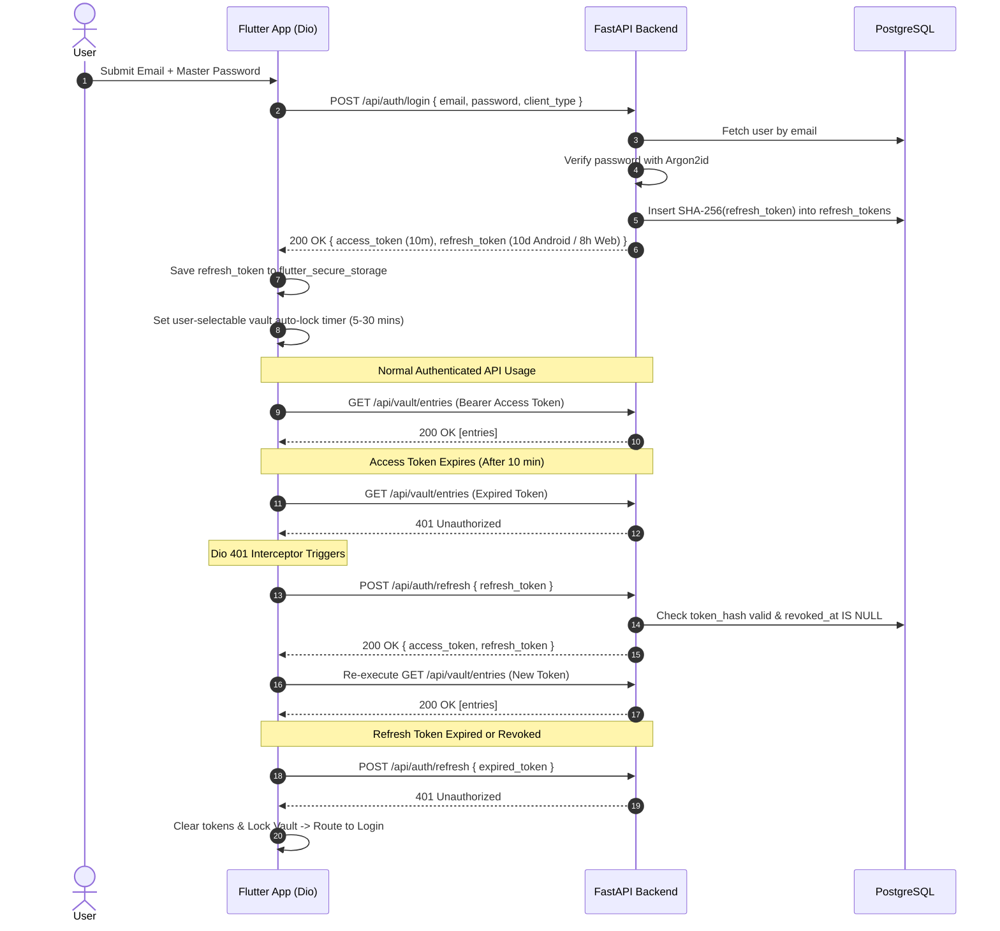

# Technical Requirements Document (TRD)
## PassMan — Offline-First, Zero-Knowledge Cross-Platform Password Manager

**Version:** 1.0 (MVP)  
**Status:** Approved  
**Author:** Engineering Team  

---

## 1. System Architecture & Component Design

PassMan utilizes a modern client-server architecture with a strict separation between client-side cryptographic processing and backend storage orchestration.

```text
┌────────────────────────────────────────────────────────────────────────┐
│                      PRESENTATION LAYER (Flutter)                      │
│   AuthScreen · VaultListScreen · EntryDetailScreen · AddEditScreen     │
│   State Management: Riverpod (AuthState, VaultState, SyncState)        │
├────────────────────────────────────────────────────────────────────────┤
│                         CLIENT SERVICES LAYER                          │
│  ┌──────────────────┐  ┌──────────────────┐  ┌───────────────────────┐  │
│  │ AES-256-GCM      │  │ Unified Cache    │  │ Network Client (Dio)  │  │
│  │ Cryptor Service  │  │ Repository       │  │ • Bearer Auth Inject  │  │
│  │ • PBKDF2 Key Der │  │ • sqflite (And)  │  │ • 401 Auto-Refresh    │  │
│  │ • Encrypt/Decrypt│  │ • Hive (Web)     │  │ • 1-Retry Policy      │  │
│  └─────────┬────────┘  └────────┬─────────┘  └───────────┬───────────┘  │
│            │                    │                        │              │
│  ┌─────────▼────────────────────▼────────────────────────▼───────────┐  │
│  │ Session Key: flutter_secure_storage (Android Keystore / Web SS)   │  │
│  └───────────────────────────────────────────────────────────────────┘  │
└────────────────────────────────────┬───────────────────────────────────┘
                                     │ HTTPS / TLS 1.3 (Bearer JWT)
┌────────────────────────────────────▼───────────────────────────────────┐
│                    API & MIDDLEWARE LAYER (FastAPI)                    │
│  CORS Middleware ──► Rate Limiter (slowapi) ──► Request Logger         │
│  ──► Auth Dependency (JWT Decode & User Context)                       │
│  ┌───────────────────┐  ┌───────────────────┐  ┌────────────────────┐  │
│  │ /api/auth Router  │  │ /api/vault Router │  │ /api/sync Router   │  │
│  └─────────┬─────────┘  └─────────┬─────────┘  └──────────┬─────────┘  │
│            │                      │                       │            │
│  ┌─────────▼──────────────────────▼───────────────────────▼──────────┐  │
│  │ Service Layer: Argon2id Verify, Ownership Guard, Async Audit Log  │  │
│  └─────────────────────────────────┬─────────────────────────────────┘  │
└────────────────────────────────────┼───────────────────────────────────┘
                                     │ asyncpg / SQLAlchemy Async Pooler
┌────────────────────────────────────▼───────────────────────────────────┐
│                   PERSISTENCE (Supabase PostgreSQL 15)                 │
│  Tables: users · vault_entries (soft-delete) · refresh_tokens · logs   │
└────────────────────────────────────────────────────────────────────────┘
```

---

## 2. Technology Stack & Dependencies

### 2.1 Mobile & Web Client (Flutter)
- **Framework:** Flutter SDK 3.x (Dart 3.x) targeting Android (API 21+) and Flutter Web.
- **State Management:** `flutter_riverpod` (v2.x) for reactive, testable dependency injection and state management.
- **Networking:** `dio` (v5.x) with custom interceptors for transparent JWT rotation and error normalization.
- **Android Local Database:** `sqflite` (SQLite wrapper for persistent offline storage).
- **Web Local Storage:** `Hive` (high-performance pure-Dart key-value storage).
- **Cryptographic Primitives:** `cryptography` / `pointycastle` / `crypto` for client-side key derivation (PBKDF2/Argon2) and AES-256-GCM.
- **Hardware Security:** `flutter_secure_storage` (backed by Android Keystore / Keychain) and `local_auth` for Biometric / PIN gating.

### 2.2 Backend API (FastAPI)
- **Runtime:** Python 3.11+ / 3.12 running under `uvicorn` (ASGI worker).
- **Web Framework:** `FastAPI` (v0.110+) with `pydantic` (v2.x) for strict payload validation.
- **Database ORM/Driver:** `SQLAlchemy` (v2.x async) with `asyncpg` for non-blocking PostgreSQL connectivity.
- **Password Hashing:** `argon2-cffi` for memory-hard master password hashing.
- **JWT Handling:** `python-jose[cryptography]` / `PyJWT` for HS256 token encoding and verification.
- **Rate Limiting:** `slowapi` (utilizing client IP keys).
- **CORS:** `fastapi.middleware.cors.CORSMiddleware`.

### 2.3 Cloud Persistence (Supabase / PostgreSQL)
- **Engine:** PostgreSQL 15 managed by Supabase.
- **Connection Mode:** Direct TCP connection via Supabase Transaction Pooler / Session Pooler (port 5432 / 6543).

---

## 3. Database Architecture & DDL (PostgreSQL)

### 3.1 `users` Table
Stores user credentials and identity. The server stores only the Argon2id hash; raw passwords never reach persistent storage.
```sql
CREATE TABLE users (
    id UUID PRIMARY KEY DEFAULT gen_random_uuid(),
    email TEXT UNIQUE NOT NULL,
    password_hash TEXT NOT NULL,   -- Argon2id formatted hash string
    salt TEXT NOT NULL,            -- Base64 salt used during hashing
    created_at TIMESTAMPTZ NOT NULL DEFAULT NOW(),
    updated_at TIMESTAMPTZ NOT NULL DEFAULT NOW()
);

CREATE INDEX idx_users_email ON users(email);
```

### 3.2 `vault_entries` Table (Soft-Delete Enabled)
Stores zero-knowledge encrypted blobs. Uses tombstones (`deleted_at`) to enable delta sync propagation to offline clients.
```sql
CREATE TABLE vault_entries (
    id UUID PRIMARY KEY DEFAULT gen_random_uuid(),
    user_id UUID NOT NULL REFERENCES users(id) ON DELETE CASCADE,
    encrypted_data TEXT NOT NULL,   -- Stringified JSON: { ciphertext, iv, tag }
    updated_at TIMESTAMPTZ NOT NULL DEFAULT NOW(),
    deleted_at TIMESTAMPTZ NULL     -- Tombstone timestamp (NULL if active)
);

-- Primary index for delta sync queries:
CREATE INDEX idx_vault_user_sync ON vault_entries(user_id, updated_at DESC);
```

> **Soft-Delete Invariant:** Hard `DELETE` statements are forbidden on this table. Deleting a record sets `deleted_at = NOW()` and updates `updated_at = NOW()`. Normal list views filter `deleted_at IS NULL`; delta sync queries omit this filter to send tombstones to synchronizing clients.

### 3.3 `refresh_tokens` Table
Tracks active refresh tokens for rotation and immediate server-side revocation.
```sql
CREATE TABLE refresh_tokens (
    id UUID PRIMARY KEY DEFAULT gen_random_uuid(),
    user_id UUID NOT NULL REFERENCES users(id) ON DELETE CASCADE,
    token_hash TEXT UNIQUE NOT NULL,  -- SHA-256 hex digest of raw refresh token
    expires_at TIMESTAMPTZ NOT NULL,
    revoked_at TIMESTAMPTZ NULL,      -- Set on logout or token reuse detection
    created_at TIMESTAMPTZ NOT NULL DEFAULT NOW()
);

CREATE INDEX idx_refresh_tokens_lookup ON refresh_tokens(token_hash, revoked_at);
```

### 3.4 `audit_logs` Table
Asynchronously records sensitive security operations without blocking HTTP worker threads.
```sql
CREATE TABLE audit_logs (
    id UUID PRIMARY KEY DEFAULT gen_random_uuid(),
    user_id UUID REFERENCES users(id) ON DELETE SET NULL,
    action TEXT NOT NULL,             -- LOGIN, REFRESH, SYNC, CREATE, UPDATE, DELETE
    ip_address INET,
    user_agent TEXT,
    created_at TIMESTAMPTZ NOT NULL DEFAULT NOW()
);

CREATE INDEX idx_audit_logs_user ON audit_logs(user_id, created_at DESC);
```

---

## 4. Local Storage Schema & Cache Strategy

### 4.1 Unified Cache Schema
To ensure consistent sync logic across Android (`sqflite`) and Web (`Hive`), both platforms share an identical logical cache contract:

```text
Table: local_vault_cache
┌────────────────────┬───────────┬────────────────────────────────────────┐
│ Column Name        │ Type      │ Description                            │
├────────────────────┼───────────┼────────────────────────────────────────┤
│ id                 │ TEXT (PK) │ UUID of the vault entry                │
│ encrypted_data     │ TEXT      │ Ciphertext blob as received from API   │
│ iv                 │ TEXT      │ Initialization vector (Base64)         │
│ tag                │ TEXT      │ GCM authentication tag (Base64)        │
│ server_updated_at  │ TEXT      │ ISO-8601 timestamp from server         │
│ deleted            │ INTEGER   │ 1 = Tombstone (hide from UI), 0 = live │
│ is_pending_sync    │ INTEGER   │ 1 = Local write awaiting push, 0 = sync│
└────────────────────┴───────────┴────────────────────────────────────────┘
```

### 4.2 Single-Layer Encryption Justification
- **No Database-Level Encryption (SQLCipher/Encrypted Hive):** Vault rows stored in the local cache are already ciphertext produced by client-side AES-256-GCM. Encrypting the SQLite or Hive file provides zero cryptographic benefit (encrypting ciphertext) while introducing key management overhead and performance degradation.
- **Session Key Protection:** The AES-256 encryption key derived from the master password is never stored in `local_vault_cache`. It resides only in volatile memory during an unlocked session and is persisted across app sessions inside **`flutter_secure_storage`** (backed by Android Keystore / Web Credential storage).

---

## 5. Cryptographic & Security Specification

### 5.1 Security Boundaries & Threat Model

```text
┌──────────────────────── TRUSTED BOUNDARY: CLIENT DEVICE ────────────────────────┐
│  • Master Password input                                                       │
│  • Key Derivation: Master Password + User Salt ──► AES-256 Session Key          │
│  • AES-256-GCM: Plaintext Entry ◄──► { ciphertext, iv, tag }                   │
│  • Session Key stored strictly in Keystore / flutter_secure_storage            │
└───────────────────────────────────────┬────────────────────────────────────────┘
                                        │ Encrypted Payload ({ciphertext, iv, tag})
                                        │ HTTPS / TLS 1.3
┌───────────────────────────────────────▼────────────────────────────────────────┐
│                     UNTRUSTED BOUNDARY: SERVER & DATABASE                      │
│  • FastAPI receives only opaque ciphertext, iv, tag, and timestamps            │
│  • Server has ZERO knowledge of master password or session key                 │
│  • Postgres stores encrypted JSON blob; DB dump exposes no plaintext           │
└────────────────────────────────────────────────────────────────────────────────┘
```

### 5.2 Encryption & Key Derivation Parameters
- **Symmetric Encryption:** AES-256 in Galois/Counter Mode (GCM).
  - Key Size: 256 bits (32 bytes).
  - Nonce/IV: 96-bit (12 bytes) cryptographically random bytes generated per encryption operation. Nonce reuse is strictly forbidden.
  - Tag Length: 128-bit (16 bytes) authentication tag verifying ciphertext integrity.
- **Key Derivation Function (KDF):** PBKDF2-HMAC-SHA256 (100,000 iterations) or Argon2id in Dart to derive the 256-bit AES key from the master password and user salt.
- **Server-Side Password Hashing:** Argon2id via `argon2-cffi`:
  - Type: `argon2.Type.ID`
  - Memory Cost: 65,536 KiB (64 MiB)
  - Time Cost: 3 iterations
  - Parallelism: 4 threads

### 5.3 PostgreSQL Row-Level Security (RLS) Architecture Rationale
- Supabase provides Row Level Security (RLS), but RLS policies only execute when queries are made under the end-user's authenticated Postgres role (e.g., PostgREST with user JWTs).
- PassMan's FastAPI backend connects to Postgres using a single, high-privilege service credential over `asyncpg`. Therefore, Postgres evaluates all requests as the service user, making Postgres-level RLS policies a no-op.
- **Enforcement Layer:** Multi-tenant ownership isolation is enforced strictly within the FastAPI service layer by injecting `WHERE user_id = current_user.id` into every SQL statement.

---

## 6. Authentication & Token Management Protocol

### 6.1 Single-Secret JWT Strategy
To avoid multi-secret synchronization complexity, both Access and Refresh tokens are signed with the same `JWT_SECRET_KEY` using `HS256`, distinguished by a mandatory `type` claim:

```json
// Access Token (Expires in 10 minutes - ANDROID_ACCESS_TOKEN_EXPIRES / WEB_ACCESS_TOKEN_EXPIRES)
{
  "sub": "b2f6b86e-9821-4f18-912b-633b497c3621",
  "type": "access",
  "exp": 1756312200,
  "iat": 1756311600
}

// Refresh Token (Android: 10 days - ANDROID_REFRESH_TOKEN_EXPIRES / Web: 8 hours - WEB_REFRESH_TOKEN_EXPIRES)
{
  "sub": "b2f6b86e-9821-4f18-912b-633b497c3621",
  "type": "refresh",
  "jti": "d38f8702-86ee-4228-a4a3-764c483a992d",
  "exp": 1757175600,
  "iat": 1756311600
}
```

### 6.2 Token Lifecycle & Auto-Refresh Flow



---

## 7. REST API Endpoints & Payload Specifications

### 7.1 Authentication Endpoints

#### `POST /api/auth/register`
- **Rate Limit:** 5 req / min
- **Request Body:**
  ```json
  {
    "email": "user@example.com",
    "password": "MasterPassword123!",
    "salt": "dGhpcy1pcy1hLXNhbHQ="
  }
  ```
- **Response (201 Created):**
  ```json
  {
    "id": "b2f6b86e-9821-4f18-912b-633b497c3621",
    "email": "user@example.com",
    "created_at": "2026-08-27T16:00:00Z"
  }
  ```

#### `POST /api/auth/login`
- **Rate Limit:** 5 req / min
- **Request Body:**
  ```json
  {
    "email": "user@example.com",
    "password": "MasterPassword123!"
  }
  ```
- **Response (200 OK):**
  ```json
  {
    "access_token": "eyJhbGciOi...",
    "refresh_token": "eyJhbGciOi...",
    "token_type": "bearer",
    "expires_in": 900
  }
  ```

#### `POST /api/auth/refresh`
- **Rate Limit:** 5 req / min
- **Request Body:**
  ```json
  {
    "refresh_token": "eyJhbGciOi..."
  }
  ```
- **Response (200 OK):**
  ```json
  {
    "access_token": "eyJhbGciOi...",
    "refresh_token": "eyJhbGciOi...",
    "token_type": "bearer",
    "expires_in": 900
  }
  ```

#### `POST /api/auth/logout`
- **Auth:** Bearer Access Token
- **Request Body:**
  ```json
  {
    "refresh_token": "eyJhbGciOi..."
  }
  ```
- **Response (200 OK):**
  ```json
  {
    "message": "Session successfully revoked"
  }
  ```

---

### 7.2 Vault Management Endpoints

#### `GET /api/vault/entries` (Delta Sync)
- **Auth:** Bearer Access Token
- **Query Parameter:** `since` (ISO-8601 string or Unix timestamp, e.g., `?since=2026-08-27T12:00:00Z`). If omitted, returns all entries.
- **SQL Logic:**
  ```sql
  SELECT id, encrypted_data, updated_at, deleted_at 
  FROM vault_entries 
  WHERE user_id = :user_id 
    AND updated_at > :since;
  ```
- **Response (200 OK):**
  ```json
  [
    {
      "id": "e4a2c1f0-1234-4567-89ab-cdef01234567",
      "encrypted_data": "{\"ciphertext\":\"...\",\"iv\":\"...\",\"tag\":\"...\"}",
      "updated_at": "2026-08-27T16:05:00Z",
      "deleted_at": null
    },
    {
      "id": "f8b3d2e1-5678-90ab-cdef-1234567890ab",
      "encrypted_data": "{\"ciphertext\":\"...\",\"iv\":\"...\",\"tag\":\"...\"}",
      "updated_at": "2026-08-27T16:10:00Z",
      "deleted_at": "2026-08-27T16:10:00Z"
    }
  ]
  ```

#### `POST /api/vault/entries`
- **Auth:** Bearer Access Token
- **Request Body:**
  ```json
  {
    "encrypted_data": "{\"ciphertext\":\"b64...\",\"iv\":\"b64...\",\"tag\":\"b64...\"}"
  }
  ```
- **Validation:** Pydantic strictly verifies that `encrypted_data` contains valid JSON with keys `ciphertext`, `iv`, and `tag`. Plaintext credential fields result in `422 Unprocessable Entity`.
- **Response (201 Created):**
  ```json
  {
    "id": "e4a2c1f0-1234-4567-89ab-cdef01234567",
    "updated_at": "2026-08-27T16:05:00Z"
  }
  ```

#### `PUT /api/vault/entries/{id}`
- **Auth:** Bearer Access Token
- **Request Body:**
  ```json
  {
    "encrypted_data": "{\"ciphertext\":\"b64...\",\"iv\":\"b64...\",\"tag\":\"b64...\"}"
  }
  ```
- **Response (200 OK):**
  ```json
  {
    "id": "e4a2c1f0-1234-4567-89ab-cdef01234567",
    "updated_at": "2026-08-27T16:15:00Z"
  }
  ```

#### `DELETE /api/vault/entries/{id}` (Soft-Delete)
- **Auth:** Bearer Access Token
- **SQL Action:** `UPDATE vault_entries SET deleted_at = NOW(), updated_at = NOW() WHERE id = :id AND user_id = :user_id;`
- **Response (200 OK):**
  ```json
  {
    "id": "e4a2c1f0-1234-4567-89ab-cdef01234567",
    "deleted_at": "2026-08-27T16:20:00Z"
  }
  ```

#### `GET /api/vault/sync/status`
- **Auth:** Bearer Access Token
- **Response (200 OK):**
  ```json
  {
    "server_time": "2026-08-27T16:25:00Z"
  }
  ```

---

## 8. Delta Synchronization & Conflict Resolution Engine

### 8.1 Sync Trigger Matrix
Sync execution is event-driven to avoid battery drain:
1. **Trigger 1 (Launch):** Immediately after rendering local cache to memory.
2. **Trigger 2 (Resume):** Upon `AppLifecycleState.resumed` event in Flutter.
3. **Trigger 3 (Manual):** User executes pull-to-refresh or presses "Sync Now".

### 8.2 Client Sync Algorithm (Last-Write-Wins)

```text
Step 1: Retrieve `last_synced_at` timestamp from local secure preferences (default 1970-01-01T00:00:00Z).
Step 2: Execute GET /api/vault/entries?since=<last_synced_at>.
Step 3: Begin Local Database Transaction:
   FOR EACH entry IN response:
      IF entry.deleted_at IS NOT NULL:
         DELETE FROM local_vault_cache WHERE id = entry.id;
      ELSE IF entry.id DOES NOT EXIST in local_vault_cache:
         INSERT INTO local_vault_cache (id, encrypted_data, server_updated_at, deleted, is_pending_sync)
         VALUES (entry.id, entry.encrypted_data, entry.updated_at, 0, 0);
      ELSE:
         LET local_entry = SELECT * FROM local_vault_cache WHERE id = entry.id;
         IF local_entry.is_pending_sync == 0:
            UPDATE local_vault_cache SET encrypted_data = entry.encrypted_data, server_updated_at = entry.updated_at
            WHERE id = entry.id;
         ELSE:
            // Conflict: Local change vs Server change (Last-Write-Wins based on timestamp)
            IF entry.updated_at > local_entry.server_updated_at:
               UPDATE local_vault_cache SET encrypted_data = entry.encrypted_data, server_updated_at = entry.updated_at, is_pending_sync = 0
               WHERE id = entry.id;
   END TRANSACTION.

Step 4: Push Local Pending Queue:
   LET pending_records = SELECT * FROM local_vault_cache WHERE is_pending_sync = 1;
   FOR EACH record IN pending_records:
      IF record.deleted == 1:
         CALL DELETE /api/vault/entries/{record.id};
         DELETE FROM local_vault_cache WHERE id = record.id;
      ELSE IF record.is_new:
         CALL POST /api/vault/entries -> receive created_id, updated_at;
         UPDATE local_vault_cache SET is_pending_sync = 0, server_updated_at = updated_at WHERE id = record.id;
      ELSE:
         CALL PUT /api/vault/entries/{record.id} -> receive updated_at;
         UPDATE local_vault_cache SET is_pending_sync = 0, server_updated_at = updated_at WHERE id = record.id;

Step 5: Store current server time as new `last_synced_at`.
```

---

## 9. Middleware & Cross-Cutting Concerns

### 9.1 Rate Limiter Configuration
- Implemented with `slowapi` using in-memory or Redis backend.
- Key: Client IP (`request.client.host`).
- Threshold: 5 requests / 60 seconds on `/api/auth/login` and `/api/auth/refresh`.
- Exceeded Response: `429 Too Many Requests` with `Retry-After` header.

### 9.2 CORS Policy
- Production: Strict origin restriction matching the deployed Flutter Web domain.
- Development: `http://localhost:3000`, `http://localhost:8080`, `http://127.0.0.1:*`.
- Allowed Methods: `GET`, `POST`, `PUT`, `DELETE`, `OPTIONS`.
- Allowed Headers: `Authorization`, `Content-Type`.

### 9.3 Asynchronous Audit Logger Middleware
- Logs every HTTP request with:
  - Timestamp, Method, Path, Response Status Code, Latency (ms).
  - Extracted User ID from JWT (if authenticated).
  - Client IP and User-Agent string.
- Writes to `audit_logs` using non-blocking background tasks (`asyncio.create_task` or FastAPI `BackgroundTasks`).

---

## 10. Testing & Verification Plan

| Level | Scope | Tools | Verification Target |
| :--- | :--- | :--- | :--- |
| **Unit (Backend)** | Password hashing, JWT encode/decode, Pydantic validation | `pytest`, `pytest-asyncio` | 100% logic coverage on auth and crypto helpers |
| **Integration (API)** | Auth endpoints, CRUD with soft delete, rate limiter | `httpx`, `pytest-asyncio` | Dual-user isolation; 401 handling on revoked refresh tokens |
| **Unit (Client)** | AES-256-GCM roundtrip, PBKDF2 derivation | `flutter test` | Plaintext -> Encrypt -> Decrypt matches original bytes exactly |
| **Widget (Client)** | Login screen, Vault list, Add/Edit form | `flutter_test` | State mutations, error banner displays, input validation |
| **Sync E2E Test** | Offline writes, reconnection push, tombstone propagation | Multi-device emulator suite | Create on Device A (offline) -> Online -> Sync to Device B; Delete on B -> Sync to A |
